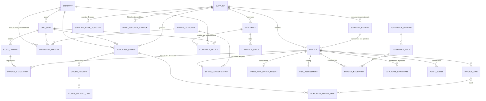

# Gestion de facturas de proveedores (compras IT)

Diseño funcional y tecnico de la solucion: modelo de datos, motor de excepciones (clasificacion de gasto,
desviaciones, duplicados, riesgo de pago y fraude), las dos pantallas construidas y el encaje de Devin via API.

## Arquitectura

Backend real (NestJS 11 + TypeORM + PostgreSQL) con el modelo de datos persistido y **todo** el motor
determinista (clasificacion, tolerancias, duplicados, riesgo, comparativa, consolidacion) en servidor. El
frontend Angular solo captura datos y presenta el veredicto, de modo que la evaluacion es reproducible y
auditable fuera de la sesion del usuario y el token de Devin nunca llega al navegador.

```text
Angular (8081)  ->  NestJS /api (8080)  ->  PostgreSQL
                          |
                          +->  api.devin.ai (token solo en servidor)
```

La gestion de facturas es una **aplicacion independiente** de la tienda e-commerce del repositorio: shell
propio (`src/app/layouts/invoice-layout/`) sin la cabecera ni el pie del e-commerce, ruta raiz `/invoices`
fuera de `MainLayoutComponent`, y look & feel corporativo tipo Volkswagen Financial Services
(`src/styles/vwfs-theme.css`, acotado a `.vwfs-app`): azul `#004666`, cian `#66e4ee`, texto `#4c5356`, fondo
`#f2f2f2`, esquinas rectas y botones en mayusculas.

| Pieza | Fichero |
| --- | --- |
| Entidades del modelo (maestros) | `backend/src/modules/master-data/entities/` |
| Entidades de factura, excepciones, duplicados, auditoria | `backend/src/modules/invoices/entities/` |
| Clasificacion de gasto y consolidacion | `backend/src/modules/invoices/services/spend-classification.service.ts` |
| Motor de excepciones / antifraude / scoring | `backend/src/modules/invoices/services/invoice-anomaly.service.ts` |
| Comparativa de dos facturas | `backend/src/modules/invoices/services/invoice-comparison.service.ts` |
| Casos de uso y persistencia | `backend/src/modules/invoices/services/invoices.service.ts` |
| Proxy de la API de Devin | `backend/src/modules/devin/` |
| Datos de ejemplo | `backend/src/seed.ts` |
| Tipos compartidos con el API | `src/app/core/models/invoice.model.ts` |
| Clientes HTTP | `src/app/core/services/invoice.service.ts`, `procurement-master-data.service.ts`, `devin-api.service.ts` |
| Shell y tema de la aplicacion | `src/app/layouts/invoice-layout/`, `src/styles/vwfs-theme.css` |
| Pantalla A (alta de factura) | `src/app/features/invoices/components/invoice-entry/` |
| Pantalla B (comparativa) | `src/app/features/invoices/components/invoice-compare/` |
| Bandeja de excepciones (entrada) | `src/app/features/invoices/components/invoice-list/` |

Rutas: `/invoices` (bandeja), `/invoices/new` (Pantalla A), `/invoices/compare` (Pantalla B).

### Puesta en marcha

```bash
docker run -d --name procurement-pg -e POSTGRES_PASSWORD=postgres \
  -e POSTGRES_DB=procurement -p 5432:5432 postgres:16-alpine

cd backend
cp .env.example .env
npm install
npm run seed        # maestros, tolerancias y 6 facturas de ejemplo
npm run start:dev   # http://localhost:8080/api (Swagger en /api/docs)

cd .. && npm start -- --port 8081
```

### API

| Operacion | Endpoint |
| --- | --- |
| Listado / detalle | `GET /api/invoices?supplierId=&limit=`, `GET /api/invoices/:id` |
| Totales agregados de la bandeja | `GET /api/invoices/summary` |
| Opciones ligeras para desplegables con busqueda | `GET /api/invoices/options?search=&limit=` |
| Evaluacion sin registrar (panel en vivo del alta) | `POST /api/invoices/preview` |
| Registro de factura | `POST /api/invoices` |
| Importacion de documento (PDF, Word, Excel) | `POST /api/invoices/import` (multipart, campo `file`) |
| Excepciones abiertas | `GET /api/invoices/exceptions` |
| Resolucion de excepcion | `PATCH /api/invoices/:invoiceId/exceptions/:exceptionId` |
| Comparativa | `GET /api/invoices/compare?left=&right=` |
| Consolidacion | `GET /api/invoices/consolidation-opportunities` |
| Investigacion con Devin de una excepcion | `POST /api/invoices/:invoiceId/exceptions/:exceptionId/devin-session` |
| Maestros | `GET /api/master-data/{categories,suppliers,contracts,purchase-orders,tolerance-profile}` |
| Alta de proveedor | `POST /api/master-data/suppliers` (con cuenta de cobro y presupuesto opcionales) |
| Presupuestos de proveedor | `GET /api/master-data/budgets`, `GET /api/master-data/budget-years`, `GET /api/master-data/suppliers/:id/budgets` |
| Informe por proveedor y ejercicio | `GET /api/reports/suppliers/:supplierId?year=`, `GET /api/reports/years` |
| Proxy Devin | `GET/POST /api/integrations/devin/...` |

---

## 1. Modelo de datos

### 1.1 Vision general



### 1.2 Entidades y por que existen

**Estructura organizativa y analitica**

- `Company`: sociedad juridica (codigo, razon social, pais, divisa). Es la primera dimension de analisis.
- `OrgUnit`: area o departamento de una sociedad. Segunda dimension; una misma area logica (p. ej.
  "Tecnologia y Sistemas") existe por sociedad, para que el gasto no se mezcle entre sociedades.
- `CostCenter` (CECO): unidad minima de imputacion, colgada de un area y por tanto de una sociedad. Es el
  dato que introduce el usuario; sociedad y area se derivan del CECO y no se piden dos veces.
- `DimensionBudget`: presupuesto asignado por ejercicio a la combinacion sociedad + area + categoria de
  compra. Es la base del cuadro de mando: convive con `SupplierBudget` (presupuesto por proveedor) porque
  responden a preguntas distintas (control organizativo vs control de proveedor).
- `InvoiceAllocation`: reparto de una factura a **uno o varios CECOs**, por importe o por porcentaje. Cada
  linea guarda CECO, sociedad, area, categoria imputada, el modo del reparto, el porcentaje y el importe
  resultante (se guardan ambos para que el analitico no tenga que recalcular sobre el total). Todo el gasto
  del cuadro de mando se agrega desde aqui, no desde la cabecera de factura.
- `ContractScope`: ambito de un contrato. Un contrato puede alcanzar 1..n sociedades y, dentro de cada una,
  1..n areas; una fila con sociedad y **sin area** significa "toda la sociedad".

Reglas del reparto (validadas en backend y en el formulario):

- todas las lineas de una factura usan el mismo criterio (todo por importe o todo por porcentaje);
- los porcentajes suman 100% y los importes suman el total de la factura, con tolerancia de 0,02;
- no se admiten importes/porcentajes nulos o negativos ni CECO+categoria repetidos;
- `invoice.costCenter`, `companyId` y `orgUnitId` se mantienen sincronizados con la imputacion principal
  (la de mayor importe) por compatibilidad con las vistas que trabajan a nivel de cabecera.

**Maestro de proveedor y cobro**

- `Supplier`: identidad fiscal, estado, antiguedad (`onboardedAt`) y `riskScore`. La antiguedad alimenta la
  regla de "proveedor reciente con importe elevado".
- `SupplierBankAccount`: cada IBAN con su estado (`verified`, `pending_verification`, ...), canal y fecha de
  verificacion. El pago solo deberia liberarse contra cuentas verificadas.
- `BankAccountChange`: log inmutable de cambios de cuenta (quien, cuando, por que canal, si se verifico).
  Es la entidad clave para detectar el fraude del "cambio de cuenta del proveedor".
- `SupplierBudget`: presupuesto asignado al proveedor **por ejercicio** (`supplierId` + `fiscalYear` unico),
  con divisa, categoria de referencia, umbral de aviso (`alertThresholdPercent`) y responsable. Cada factura
  consume el presupuesto del ejercicio de su fecha de emision: el consumo no se guarda duplicado, se agrega
  desde `Invoice` para que no pueda desincronizarse del dato real.

**Compromisos y referencia de precio**

- `Contract` + `ContractPrice` + `ContractScope`: un proveedor puede tener 1..n contratos, cada uno con su
  vigencia, categoria, compromiso anual, condiciones de pago, descuento por pronto pago y su ambito
  organizativo. Dan la referencia para medir desviaciones de precio y condiciones.
- `PurchaseOrder` + `PurchaseOrderLine` (con `receivedQuantity` / `invoicedQuantity`) y
  `GoodsReceipt` + `GoodsReceiptLine`: permiten la conciliacion a tres bandas (factura / pedido / recepcion)
  y evitan sobrefacturacion en pedidos parcialmente facturados.

**Factura**

- `Invoice`: cabecera con fechas (emision, recepcion, vencimiento), divisa y tipo de cambio, importes
  declarados en el documento, datos de cobro (`bankAccountIban`, `bankAccountHolder`), imputacion
  (`costCenter`), `source` (manual, OCR, EDI, correo, portal) y estado del workflow.
- `InvoiceLine`: cantidad, UdM, precio unitario, impuesto, categoria de gasto y cuenta contable derivadas,
  y enlace opcional a la linea de pedido.

Se guardan **los importes declarados** por el proveedor y **los calculados** desde lineas: la comparacion de
ambos es lo que detecta descuadres y manipulacion de totales.

**Inteligencia sobre la factura**

- `SpendCategory` (taxonomia jerarquica con `keywords`, `glAccount`) y `SpendClassification`
  (categoria asignada + `confidence` + `method` + terminos que la justifican). La confianza permite enviar a
  revision solo lo dudoso y mantener explicabilidad.
- `ThreeWayMatchResult`: desviaciones de importe, cantidad y precio, y lineas sin correspondencia.
- `ToleranceProfile` / `ToleranceRule`: catalogo configurable de umbrales por regla (valor, unidad,
  severidad, si bloquea pago, ambito por categoria / proveedor / importe). **Es lo que hace que solo se revise
  la excepcion, no la factura.**
- `InvoiceException`: excepcion concreta con valor observado vs tolerancia, severidad, estado del ciclo de
  vida (`open`, `in_review`, `resolved`, `false_positive`, `escalated`), nota de resolucion y
  `devinSessionId` cuando la investigacion se delega a Devin.
- `DuplicateCandidate`: pareja de facturas con score de similitud y campos coincidentes (evidencia).
- `RiskAssessment` + `RiskSignal`: score 0-100, banda y recomendacion (`auto_release`, `manual_review`,
  `block`), con el detalle de señales que suman al score.
- `AuditEvent`: trazabilidad de alta, bloqueo, resolucion de excepciones y sesiones de Devin creadas.

### 1.3 Catalogo de reglas implementado

| Codigo | Que detecta | Tolerancia por defecto | Bloquea pago |
| --- | --- | --- | --- |
| `DUPLICATE_EXACT` | Mismo proveedor + numero + importe | 0 | Si |
| `DUPLICATE_FUZZY` | Similitud alta con otra factura (numero normalizado, importe, fecha, PO, IBAN) | 70% | Si |
| `BANK_ACCOUNT_UNKNOWN` | IBAN no registrado, sin verificar o titular discrepante | 0 | Si |
| `BANK_ACCOUNT_RECENT_CHANGE` | Cobro en cuenta registrada recientemente o distinta de la principal | 30 dias | Si |
| `PRICE_DEVIATION_CONTRACT` | Precio unitario por encima de tarifa contratada | 5% | No |
| `PO_AMOUNT_VARIANCE` | Desviacion de importe/cantidad o lineas fuera de pedido | 2% | No |
| `PO_MISSING` | Gasto sin pedido de compra (maverick spend) | 3.000 EUR | No |
| `TOTALS_MISMATCH` | Suma de lineas != base, o base + impuesto != total | 1 EUR | Si |
| `TAX_MISMATCH` | Impuesto declarado != calculado | 1 EUR | No |
| `THRESHOLD_SPLITTING` | Importe justo por debajo del umbral de aprobacion (fraccionamiento) | 5% | No |
| `ROUND_AMOUNT` | Importes redondos altos sin detalle proporcional | 10.000 EUR | No |
| `AMOUNT_OUTLIER_HISTORY` | Desviacion sobre la media historica del proveedor | 50% | No |
| `NEW_SUPPLIER_HIGH_AMOUNT` | Proveedor de alta reciente con importe elevado | 10.000 EUR | Si |
| `PAYMENT_TERMS_MISMATCH` | Condiciones de pago distintas del contrato (riesgo financiero) | 5 dias | No |
| `CURRENCY_MISMATCH` | Divisa distinta de la contratada | 0 | No |
| `BACKDATED_INVOICE` | Retraso excesivo entre emision y recepcion | 90 dias | No |
| `LOW_CLASSIFICATION_CONFIDENCE` | Clasificacion de gasto poco fiable | 60% | No |

El score de riesgo agrega las excepciones por severidad (low 5, medium 15, high 30, critical 45) mas el
riesgo de maestro del proveedor, y decide entre liberacion automatica, revision manual o bloqueo.

### 1.4 Clasificacion del gasto y consolidacion

La clasificacion combina, en este orden: categoria forzada manualmente, coincidencia de terminos sobre
descripcion y lineas (ponderada por el importe de linea), y categoria por defecto del proveedor. Devuelve
siempre confianza y los terminos que la justifican, de modo que solo se revisa lo que baja del umbral.

Las oportunidades de consolidacion se calculan agrupando gasto por categoria: cuando dos o mas proveedores
facturan en la misma categoria se estima el ahorro por unificacion de volumen y homogeneizacion de
condiciones.

---

## 2. Pantallas

### 2.1 Pantalla A - Alta de factura (`/invoices/new`)

- Cabecera, datos de pago, lineas dinamicas e importes declarados en el documento.
- **Reparto por centro de coste**: la factura se imputa a un CECO o a N CECOs, eligiendo un unico criterio
  (por porcentaje o por importe). El formulario muestra el importe resultante de cada linea, el total
  imputado y lo que queda sin imputar, permite imputar el resto en una linea con un clic, convierte los
  valores al cambiar de criterio (60/40 pasa a 726/484 en una factura de 1.210) y bloquea el guardado
  mientras el reparto no cuadre o haya CECOs repetidos. La sociedad y el area de cada linea se muestran
  derivadas del CECO elegido.
- **Importar desde fichero**: se sube la factura en PDF, Word (`doc`/`docx`) o Excel (`xls`/`xlsx`/`csv`) y el
  backend extrae los campos (`POST /api/invoices/import`) para prerellenar el formulario. La extraccion es
  determinista: texto del documento (pdf-parse / mammoth / exceljs) + busqueda por etiquetas y patrones
  (numero, fechas, NIF, pedido, contrato, IBAN, titular, centro de coste, divisa, IVA, base/cuota/total y
  tabla de lineas), con identificacion del proveedor en el maestro por NIF, IBAN o razon social. La pantalla
  muestra cada campo detectado con su fiabilidad y el texto de origen, ademas de avisos de descuadre y de
  campos no encontrados; **la factura no se registra hasta que una persona valida la propuesta**.
- **Emisor desconocido**: si el NIF del documento no esta en el maestro, no se propone proveedor (una coincidencia
  parcial por nombre asignaria al proveedor equivocado) y la pantalla pregunta si se quiere dar de alta. Al
  confirmar se abre el alta de proveedor (2.4) prerellenada con los datos leidos del fichero y, tras guardarla,
  el proveedor queda seleccionado en la factura que se estaba dando de alta.
- Al seleccionar proveedor se precargan condiciones de pago y su cuenta principal, y se muestran todas sus
  cuentas registradas con su estado (control visual de cambio de IBAN).
- Panel lateral en vivo alimentado por `POST /api/invoices/preview` (evaluacion real, sin persistir): totales calculados, categoria de gasto asignada con confianza y terminos,
  score de riesgo con recomendacion, resultado de conciliacion con el pedido y **excepciones sobre
  tolerancia** separando las que bloquean el pago.
- Al guardar, la factura queda `approved` (sin excepciones), `under_review` (excepciones toleradas) o
  `blocked` (excepcion critica), con su traza de auditoria.

### 2.2 Pantalla B - Comparativa de dos facturas (`/invoices/compare`)

- Dos desplegables buscables sobre el registro de facturas (busqueda en servidor por numero, proveedor o
  NIF), con intercambio y filtro "solo diferencias".
- Veredicto de duplicado con score ponderado y campos coincidentes.
- Tabla campo a campo con delta absoluto y porcentual, marcando cada campo como señal de duplicado,
  señal antifraude o informativo; resaltado especifico de cambios de IBAN, titular y divisa.
- Detalle de lineas y excepciones de cada factura, y boton "Investigar con IA" que abre un pop-up con la
  conclusion en lenguaje natural (veredicto, evidencias y accion propuesta), sin exponer el payload tecnico.

### 2.3 Pantalla C - Informe por proveedor (`/invoices/report`)

- Filtros de sociedad, area/departamento y categoria de compra ademas de proveedor y ejercicio: el informe
  se calcula sobre las imputaciones que cumplen el filtro, de modo que el mismo proveedor puede analizarse
  "como lo ve" cada sociedad o area.

- Desplegable de proveedor con busqueda incremental, desplegable de ejercicio y boton "Mostrar informe":
  el informe solo se solicita al pulsarlo.
- Consumido vs presupuesto: importe asignado, consumido, disponible, porcentaje, desviacion y proyeccion
  lineal a cierre de ejercicio, con barra de consumo y umbral de aviso.
- Alertas por presupuesto, proyeccion, pagos bloqueados, excepciones abiertas, duplicados y cambios de IBAN.
- Seguimiento del proveedor: importe medio y maximo, dias de pago reales frente a los contratados, riesgo
  medio, tasa de excepcion, facturas sin pedido y variacion frente al ejercicio anterior.
- Evolucion mensual (gasto, acumulado y presupuesto acumulado), desviaciones, gasto por categoria y ultimas
  facturas del ejercicio con su estado, riesgo y excepciones.

Todos los desplegables de la aplicacion usan el mismo componente `app-searchable-select`: el usuario escribe
y la lista se reduce (filtrado local en listas cerradas, busqueda en servidor para el registro de facturas).

### 2.4 Cuadro de mando de compras (`/invoices/analytics`)

- Filtros de sociedad, area, categoria de compra, proveedor, periodo (mensual / trimestral / anual) y
  ejercicio; el informe se pide al pulsar "Generar informe".
- KPIs: presupuesto asignado, consumo real, compromisos pendientes de pedidos abiertos, presupuesto
  disponible, porcentaje de ejecucion, desviacion absoluta y porcentual, y variacion frente al mismo periodo
  del ejercicio anterior.
- Agrupacion conmutable por sociedad, area o categoria, con barra de ejecucion y desviacion por fila.
- Graficos: ejecucion presupuestaria acumulada con proyeccion a cierre, consumo por periodo contra
  presupuesto y contra el año anterior, y evolucion del gasto de los principales proveedores.
- Indicadores de proveedor: importe adjudicado, numero de pedidos, cumplimiento de plazos, incidencias
  registradas y riesgo medio; y panel de alertas y excepciones.

El compromiso pendiente se netea **pedido a pedido** (aprobado menos facturado contra ese pedido, sin bajar
de cero), de forma que el resumen y cualquier agrupacion cuadran entre si y el gasto ya facturado no se
cuenta dos veces.

### 2.5 Listado de proveedores (`/invoices/suppliers`)

- Busqueda incremental por nombre, NIF o categoria.
- Por proveedor: sociedades y areas a las que esta asociado (derivadas de sus imputaciones reales), numero
  de contratos, consumo, numero de facturas y aviso de cuentas de cobro pendientes de verificar (sin exponer
  los IBAN en el listado).
- Detalle desplegable con el importe imputado por sociedad y area, y cada contrato con su referencia,
  vigencia, estado, categoria, compromiso anual y su ambito de sociedades y areas.

### 2.6 Alta de proveedor (`/invoices/suppliers/new`)

- Identificacion (NIF/CIF, razon social, nombre comercial, pais, estado, categoria habitual, plazo de pago,
  email de contacto y riesgo de maestro), cuenta de cobro y presupuesto anual del ejercicio.
- La cuenta de cobro se registra **pendiente de verificacion**: los controles antifraude (`BANK_ACCOUNT_UNKNOWN`,
  `BANK_ACCOUNT_RECENT_CHANGE`) siguen aplicando sobre las facturas de ese proveedor.
- El presupuesto es opcional; si se informa, el informe de proveedor compara consumido vs budget desde la
  primera factura.
- Se usa como pantalla propia o embebida en un dialogo desde la importacion de facturas; en ese caso, al
  guardar, el proveedor queda seleccionado en la factura en curso sin perder lo ya importado.

### 2.7 Datos sinteticos

`npm run seed` (en `backend/`) carga el maestro de demostracion y ademas genera un volumen realista
determinista: 50 proveedores adicionales x 100 facturas (mas de 5.000 facturas), sus pedidos de compra,
presupuestos de 2024, 2025 y 2026 y una proporcion controlada de anomalias (reenvios duplicados, gasto sin
pedido, descuadres de totales, importes redondeados atipicos y cambios de IBAN) para que el motor de
excepciones y el informe tengan casos reales que mostrar.

Para la parte analitica genera ademas: cuatro sociedades (tres espanolas y una portuguesa) con sus areas y
CECOs, presupuestos por sociedad + area + categoria de los tres ejercicios, de uno a tres contratos por
proveedor con ambitos multi-sociedad y multi-area (incluidos ambitos de sociedad completa), pedidos cerrados
y **pedidos abiertos sin factura** para que los compromisos pendientes no sean cero, y facturas imputadas a
uno, dos o tres CECOs alternando reparto por porcentaje y por importe.

---

## 3. Encaje de Devin

### 3.1 Que apoya Devin de forma eficiente

| Tarea | Encaje | Por que |
| --- | --- | --- |
| Investigacion de excepciones de duplicado | Alto | Trabajo de recopilacion de evidencia en varios sistemas (ERP, gestor documental, correo), sin decision de pago. |
| Verificacion de cambio de cuenta bancaria | Alto | Reune evidencia y prepara el guion de verificacion; la liberacion sigue siendo humana. |
| Analisis periodico de consolidacion de proveedores | Alto | Analitica no critica en tiempo real, con entregable en informe. |
| Mantenimiento del catalogo de reglas y conectores (nuevas reglas, tests, backtesting, PR) | Alto | Tarea de ingenieria con criterio de aceptacion claro y verificable. |
| Normalizacion de maestros y taxonomia de categorias | Medio | Util en lote, requiere validacion humana del resultado. |

### 3.2 Que NO se delega a Devin

- **Decision de liberacion o bloqueo de pago**: debe ser determinista, sub-segundo y auditable regla a regla.
  Se queda en el motor de reglas del backend.
- **Aprobacion final de excepciones y cambios de datos maestros bancarios**: requiere responsabilidad humana
  (segregacion de funciones y control interno).
- **Calculo del score de riesgo en el flujo de alta**: debe ser reproducible y explicable ante auditoria.

### 3.3 Llamadas a la API

Los payloads se construyen en `src/app/core/services/devin-api.service.ts` y salen por el proxy
`backend/src/modules/devin/`, que es el unico que conoce `DEVIN_SERVICE_TOKEN` y `DEVIN_ORG_ID`.
Endpoints v3 de ambito organizacion que invoca el backend:

| Operacion | Endpoint |
| --- | --- |
| Crear sesion | `POST /v3/organizations/{org_id}/sessions` |
| Consultar sesion | `GET /v3/organizations/{org_id}/sessions/{devin_id}` |
| Enviar mensaje | `POST /v3/organizations/{org_id}/sessions/{devin_id}/messages` |

El navegador solo llama a `/api/integrations/devin/*`; el backend añade
`Authorization: Bearer <service user token>`. **El token de servicio no viaja al navegador.** Sin credenciales
configuradas, `GET /api/integrations/devin/status` devuelve `{ "configured": false }` y la creacion de sesion
responde 503, sin filtrar nada.

Ejemplo (investigacion de duplicado, el payload que construye
`buildDuplicateInvestigationRequest`):

```bash
curl -X POST "https://api.devin.ai/v3/organizations/$ORG_ID/sessions" \
  -H "Authorization: Bearer $DEVIN_SERVICE_TOKEN" \
  -H "Content-Type: application/json" \
  -d '{
    "prompt": "Contexto: departamento de compras...\nSe ha detectado una excepcion de posible duplicado sobre la factura NIM-2026-0741...",
    "title": "Investigacion duplicado NIM-2026-0741 vs NIM 2026 0741",
    "tags": ["compras", "facturas-proveedor", "duplicados", "invoice:NIM-2026-0741"],
    "idempotent": true,
    "max_acu_limit": 10,
    "structured_output_schema": {
      "type": "object",
      "required": ["verdict", "confidence", "evidence", "recommended_action"],
      "properties": {
        "verdict": { "type": "string", "enum": ["duplicate", "not_duplicate", "needs_human_input"] },
        "confidence": { "type": "number", "minimum": 0, "maximum": 100 },
        "evidence": { "type": "array", "items": { "type": "string" } },
        "recommended_action": {
          "type": "string",
          "enum": ["block_payment", "release_payment", "request_credit_note", "escalate"]
        },
        "notes": { "type": "string" }
      }
    }
  }'
```

Puntos de diseño de la integracion:

- `structured_output_schema` fuerza una respuesta procesable (veredicto, evidencia, accion recomendada) que
  la aplicacion puede guardar en la excepcion en lugar de texto libre.
- `idempotent: true` en las investigaciones evita crear sesiones duplicadas si el analista reintenta.
- `tags` incluyen el numero de factura para trazar coste (ACUs) por excepcion investigada.
- `max_acu_limit` acota el coste por tarea.
- El `session_id` devuelto se guarda en `InvoiceException.devinSessionId` (via
  `POST /api/invoices/:invoiceId/exceptions/:exceptionId/devin-session`), la excepcion pasa a `in_review` y
  queda registrada en la auditoria.
- En los prompts se indica explicitamente que Devin **no** libera pagos ni modifica datos maestros.
